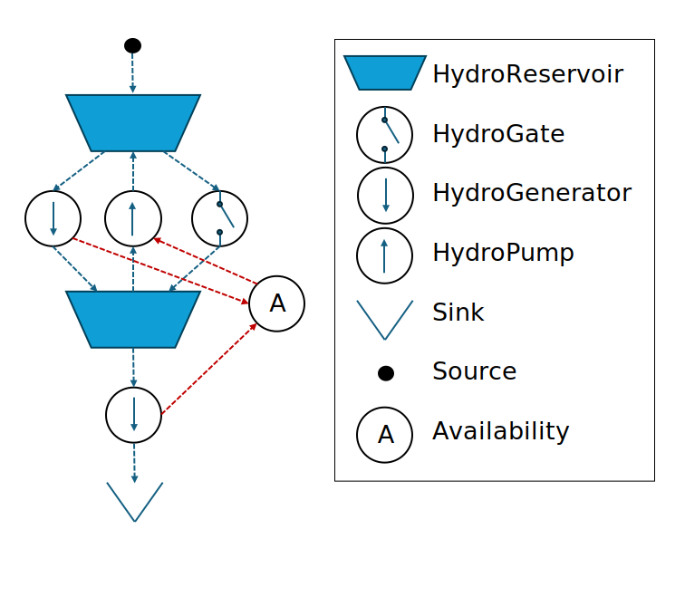

# [Detailed hydropower](@id nodes-det_hydro_power)

Cascaded hydropower systems can be modelled using the [`HydroReservoir`](@ref), [`HydroGate`](@ref), [`HydroGenerator`](@ref), and [`HydroPump`](@ref) nodes.
The nodes can be used in combination to model a detailed hydropower system.
Unlike [`HydroStorage`](@ref), these nodes allow for modelling of water as a resource that can be stored in reservoirs and moved between reservoirs to generate/consume electricity. The defined node types are:

- [`HydroReservoir`](@ref) can have water as the stored resource. It is explained in more detail on its *[nodal page](@ref nodes-det_hydro_power-reservoir)*.
- [`HydroGenerator`](@ref) can generate electricity by moving water to a reservoir at a lower altitude or the ocean. It is explained in more detail on its *[nodal page](@ref nodes-det_hydro_power-generator)*.
- [`HydroPump`](@ref) can move water to a reservoir at a higher altitude by consuming electricity. It is explained in more detail on its *[nodal page](@ref nodes-det_hydro_power-pump)*.
- [`HydroGate`](@ref) can discharge to lower reservoirs without producing electricity, for example due to spillage or environmental restrictions in the water course. It is explained in more detail on its *[nodal page](@ref nodes-det_hydro_power-gate)*.

!!! warning
    The defined node types have to be used in combination to set up a hydropower system.
    They should not be used as stand-alone nodes.

## [Philosophy of the detailed hydropower nodes](@id nodes-det_hydro_power-phil)

The detailed hydropower nodes provide a flexible means to represent the physics of cascaded hydropower systems.
By connecting nodes of different  types, unique systems with optional number of reservoirs, generators, pumps and discharge gates can be modelled.

The [`HydroReservoir`](@ref) node is a storage node used for storing water, while [`HydroGenerator`](@ref), [`HydroPump`](@ref) and [`HydroGate`](@ref) nodes move water around in the system.
In addition, [`HydroGenerator`](@ref) and [`HydroPump`](@ref) nodes convert potential energy to electric energy and *vice versa*.

The detailed modelling of hydropower requires two resources to be defined: a water resource and an electricity resource.  [`HydroReservoir`](@ref) and [`HydroGate`](@ref) nodes only use the water resource, while [`HydroGenerator`](@ref) and [`HydroPump`](@ref) nodes use both resources.

The nodes should be connected by [`links`](@extref lib-pub-links) to represent the water ways in the system. Links are also used to define flow of electricity in and out of the system through [`HydroPump`](@ref) and [`HydroGenerator`](@ref) nodes, respectively.

!!! danger "Direct linking required"
    The nodes included in the water way should be connected directly and not through an [`Availability`](@extref EnergyModelsBase.Availability) node. An availability node can be used to connect electricity resources, but the water resource must be excluded from the availability node to prevent that the availability node is used to move water to reservoirs with higher altitude without consuming electricity.

!!! danger "Reservoir input and output required"
    All nodes must have both input and output.
    Therefore, a [`RefSource`](@extref EnergyModelsBase.RefSource) node with capacity 0 should be connected to the reservoir at the top of the water course.
    Similarly, the water transported through the hydropower system requires a final destination.
    The ocean, or similar final destination, should be represented as a [`RefSink`](@extref EnergyModelsBase.RefSink) with the water resource as input an no surplus penalty.
    This way, it can accept any amount of water.

!!! warning "Detailed hydropower nodes and investment models"
    The current implementation of nodes described below does not allow their usage in capacity expansion models.
    This is checked through the function `EMB.check_node_data` in the `EnergyModelsInvestments` extension.

Some of the node types has similar functionality and use some of the same code.
The following, describes some general functionality before a more detailed description of the nodes are provided.

The illustration below shows a typical hydropower system where the dotted lines illustrate the links between the nodes.

## [Conversion to/from electric energy: the power-discharge relationship](@id nodes-det_hydro_power-phil-pq)

The conversion between energy stored in the water resources in the hydropower system and electric energy is described by a power-discharge relationship.
The conversion process in the [`HydroGenerator`](@ref) and [`HydroPump`](@ref) nodes are reversed processes and modelled using the same implementation.

The conversion is based on a set of PQ-points that describes the relationship between electric energy (power) and discharge of water, namely how much electric energy that is generated per volume of water discharged per time unit.
For a [`HydroPump`](@ref) node, the PQ-points describes how much electric energy the pump consumes per unit of water that is pumped to a higher reservoir, or how much water that is pumped per unit of electric energy consumed.
The PQ-points are provided as input through the `pq_curve` field of the  [`HydroGenerator`](@ref) and [`HydroPump`](@ref) nodes.

!!! note "Relative `PqPoints`"
     The  [`PqPoints`](@ref) are relative to the installed capacity. This approach makes if possible to freely chose the capacity of the node (provided in the field `cap::TimeProfile`) to refer to the electricity resource (power capacity) or the water resource (discharge/pump capacity) of the node, depending on the input used when setting up det hydropower system.

!!! note "Energy equivalent"
    Alternatively, a single value representing the energy equivalent can be provided as input in the field `pq_curve`.
    By the use of a constuctor, a [`PqPoints`](@ref) struct consisting of a minimum and maximum point is then created based on the energy equvalent.
    If a single energy equivalent is given as input, the installed capacity (provided in the field `cap::TimeProfile`) must refer to the power capacity of the [`HydroGenerator`](@ref) or [`HydroPump`](@ref) nodes.

## [Additional constraints](@id nodes-det_hydro_power-phil-con)

In addition to the constraints describing the physical system, hydropower systems are subject to a wide range of regulatory constraints or self-imposed constraints.
Examples for these constraints are to preserve ecological conditions, facilitate multiple use of water (such as for agriculture or recreation), or ensure safe operation before/during maintanance or in the high season for recreational acitivities in the water courses.
Often, such constraints can be translated into a schedule, a minimum, or maximum constraint.
A general functionality has been implemented for adding such constraints to [`HydroReservoir`](@ref), [`HydroGate`](@ref), [`HydroGenerator`](@ref), and [`HydroPump`](@ref) nodes.
The constraints are optional through the use of the **`data::Vector{Data}`** fields.

!!! note "ScheduleConstraint scaling"
    ScheduleConstraint inputs are given as values relative to a node capacity.
    For example, a constraint value 0.5 represents 50% of the node capacity. This makes the use of constraints in investment models possible where the capacity is not known ahead.

- Minimum constraints ([MinSchedule](@ref EnergyModelsRenewableProducers.MinSchedule)): hard constraints (absolute) or soft constraints (with a penalty for violation) that restricts the minimum of a variable to a given value (*e.g.*, discharge, power, reservoir level)
- Maximum constraints ([MaxSchedule](@ref EnergyModelsRenewableProducers.MaxSchedule)): hard constraints (absolute) or soft constraints (with a penalty for violation) that restricts the maximum of a variable to a given value (*e.g.*, discharge, power, reservoir level)
- Schedule constraints ([EqualSchedule](@ref EnergyModelsRenewableProducers.EqualSchedule)): hard constraints (absolute) or soft constraints (with a penalty for violation) that restricts a variable to a given value (*e.g.*, discharge, power, reservoir level)

The minimum, maximum, and schedule constraints are subtypes of the abstract type [ScheduleConstraint{T<:AbstractScheduleType}](@ref EnergyModelsRenewableProducers.ScheduleConstraint), where new constraints types can be implemeted as subtypes.

## [End-value setting of water](@id nodes-det_hydro_power-phil-wv)

Scheduling of large reservoirs typically require a method for valuating the future oportunity value of storing water beyond the optimization horizon.
This will be included in the EMX receeding horizon package that is under development.
