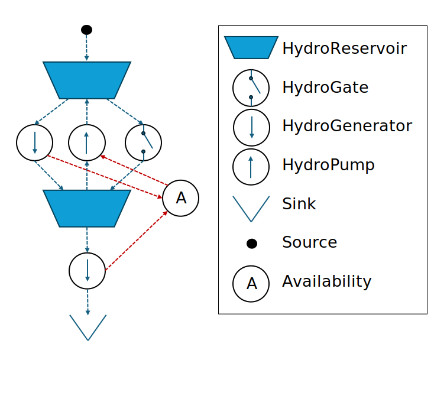

# [Detailed hydropower](@id nodes-det_hydro_power)

Cascaded hydropower systems can be modelled using the [`HydroReservoir`](@ref), [`HydroGate`](@ref), [`HydroGenerator`](@ref), and [`HydroPump`](@ref) nodes.
The nodes can be used in combination to model a detailed hydropower system.
Unlike [`HydroStorage`](@ref), these nodes allow for modelling of water as a resource that can be stored in reservoirs and moved between reservoirs to generate/consume electricity. The defined node types are:

- [`HydroReservoir`](@ref) can have water as the stored resource.
- [`HydroGenerator`](@ref) can generate electricity by moving water to a reservoir at a lower altitude or the ocean.
- [`HydroPump`](@ref) can move water to a reservoir at a higher altitude by consuming electricity.
- [`HydroGate`](@ref) can discharge to lower reservoirs without producing electricity, for example due to spillage or environmental restrictions in the water course.

!!! warning
    The defined node types have to be used in combination to set up a hydropower system.
    They should not be used as stand-alone nodes.

## [Philosophy of the detailed hydropower nodes](@id nodes-det_hydro_power-phil)

The detailed hydropower nodes provide a flexible means to represent the physics of cascaded hydropower systems.
By connecting nodes of different  types, unique systems with optional number of reservoirs, generators, pumps and discharge gates can be modelled.

The [`HydroReservoir`](@ref) node is a storage node used for storing water, while [`HydroGenerator`](@ref), [`HydroPump`](@ref) and [`HydroGate`](@ref) nodes move water around in the system.
In addition, [`HydroGenerator`](@ref) and [`HydroPump`](@ref) nodes convert potential energy to electric energy and *vice versa*.

The detailed modelling of hydropower requires two resources to be defined: a water resource and an electricity resource.  [`HydroReservoir`](@ref) and [`HydroGate`](@ref) nodes only use the water resource, while [`HydroGenerator`](@ref) and [`HydroPump`](@ref) nodes use both resources.

The nodes should be connected by [`links`](@extref lib-pub-links) to represent the water ways in the system. Links are also used to define flow of electricity in and out of the system through [`HydroPump`](@ref) and [`HydroGenerator`](@ref) nodes, respectively.

!!! danger "Direct linking required"
    The nodes included in the water way should be connected directly and not through an [`Availability`](@extref EnergyModelsBase.Availability) node. An availability node can be used to connect electricity resources, but the water resource must be excluded from the availability node to prevent that the availability node is used to move water to reservoirs with higher altitude without consuming electricity.

!!! danger "Reservoir input and input required"
    All nodes must have both input and output.
    Therefore, a [`RefSource`](@extref EnergyModelsBase.RefSource) node with capacity 0 should be connected to the reservoir at the top of the water course.
    Similarly, the water transported through the hydropower system requires a final destination.
    The ocean, or similar final destination, should be represented as a [`RefSink`](@extref EnergyModelsBase.RefSink) with the water resource as input an no surplus penalty.
    This way, it can accept any amount of water.

!!! warning "Detailed hydropower nodes and investment models"
    The current implementation of nodes described below does not allow their usage in capacity expansion models.
    This is checked through the function `EMB.check_node_data` in the `EnergyModelsInvestments` extension.

Some of the node types has similar functionality and use some of the same code.
The following, describes some general functionality before a more detailed description of the nodes are provided.

The illustration below shows a typical hydropower system where the dotted lines illustrate the links between the nodes.



### [Conversion to/from electric energy: the power-discharge relationship](@id nodes-det_hydro_power-phil-pq)

The conversion between energy stored in the water resources in the hydropower system and electric energy is described by a power-discharge relationship.
The conversion process in the [`HydroGenerator`](@ref) and [`HydroPump`](@ref) nodes are reversed processes and modelled using the same implementation.

The conversion is based on a set of PQ-points that describes the relationship between electric energy (power) and discharge of water, namely how much electric energy that is generated per volume of water discharged per time unit.
For a [`HydroPump`](@ref) node, the PQ-points describes how much electric energy the pump consumes per unit of water that is pumped to a higher reservoir, or how much water that is pumped per unit of electric energy consumed.
The PQ-points are provided as input through the `pq_curve` field of the  [`HydroGenerator`](@ref) and [`HydroPump`](@ref) nodes.

!!! note "Relative `PqPoints`"
     The  [`PqPoints`](@ref) are relative to the installed capacity. This approach makes if possible to freely chose the capacity of the node (provided in the field `cap::TimeProfile`) to refer to the electricity resource (power capacity) or the water resource (discharge/pump capacity) of the node, depending on the input used when setting up det hydropower system.

!!! note "Energy equivalent"
    Alternatively, a single value representing the energy equivalent can be provided as input in the field `pq_curve`.
    By the use of a constuctor, a [`PqPoints`](@ref) struct consisting of a minimum and maximum point is then created based on the energy equvalent.
    If a single energy equivalent is given as input, the installed capacity (provided in the field `cap::TimeProfile`) must refer to the power capacity of the [`HydroGenerator`](@ref) or [`HydroPump`](@ref) nodes.

### [Additional constraints](@id nodes-det_hydro_power-phil-con)

In addition to the constraints describing the physical system, hydropower systems are subject to a wide range of regulatory constraints or self-imposed constraints.
Examples for these constraints are to preserve ecological conditions, facilitate multiple use of water (such as for agriculture or recreation), or ensure safe operation before/during maintanance or in the high season for recreational acitivities in the water courses.
Often, such constraints can be translated into a schedule, a minimum, or maximum constraint.
A general functionality has been implemented for adding such constraints to [`HydroReservoir`](@ref), [`HydroGate`](@ref), [`HydroGenerator`](@ref), and [`HydroPump`](@ref) nodes.
The constraints are optional through the use of the **`data::Vector{Data}`** fields.

!!! note "Constraint scaling"
    Constraint inputs are given as values relative to a node capacity.
    For example, a constraint value 0.5 represents 50% of the node capacity. This makes the use of constraints in investment models possible where the capacity is not known ahead.

- Minimum constraints ([MinConstraintType](@ref EnergyModelsRenewableProducers.MinConstraintType)): hard constraints (absolute) or soft constraints (with a penalty for violation) that restricts the minimum of a variable to a given value (*e.g.*, discharge, power, reservoir level)
- Maximum constraints ([MaxConstraintType](@ref EnergyModelsRenewableProducers.MaxConstraintType)): hard constraints (absolute) or soft constraints (with a penalty for violation) that restricts the maximum of a variable to a given value (*e.g.*, discharge, power, reservoir level)
- Schedule constraints ([ScheduleConstraintType](@ref EnergyModelsRenewableProducers.ScheduleConstraintType)): hard constraints (absolute) or soft constraints (with a penalty for violation) that restricts a variable to a given value (*e.g.*, discharge, power, reservoir level)

The minimum, maximum, and schedule constraints are subtypes of the abstract type [Constraint{T<:AbstractConstraintType}](@ref EnergyModelsRenewableProducers.Constraint), where new constraints types can be implemeted as subtypes.

### [End-value setting of water](@id nodes-det_hydro_power-phil-wv)

Scheduling of large reservoirs typically require a method for valuating the future oportunity value of storing water beyond the optimization horizon.
This will be included in the EMX receeding horizon package that is under development.

# [Hydro reservoir node](@id nodes-reservoir)

### [Introduced type and its field](@id nodes-reservoir-fields)

The [`HydroReservoir`](@ref) nodes represents a water storage in a hydropower system.
In its simplest form, the [`HydroGenerator`](@ref) and [`HydroPump`](@ref) can convert potential energy between [`HydroReservoir`](@ref) nodes at different head levels to electricity, under the assumption that the reservoirs have constant head levels.
In these cases, the [`HydroReservoir`](@ref) node does not require a description of the relation between volume level and head level.
For more detailed modelling, this relation is required to account for the increased power output when the head level difference between reservoirs increase. Head-dependencies are currently not implemented.

!!! warning "Spillage"
    The [`HydroReservoir`](@ref) nodes do not include a spillage variable. To avoid infeasible solutions, all reservoir nodes should be connected to a [`HydroGate`](@ref) node representing a water way for spillage in case of full reservoirs.

#### [Standard fields](@id nodes-reservoir-fields-stand)

The [`HydroReservoir`](@ref) nodes builds on the [`RefStorage`](@extref EnergyModelsBase.RefStorage) node type. The tandard fields are given as:

- **`id`**:\
  The field `id` is only used for providing a name to the node.
  This is similar to the approach utilized in `EnergyModelsBase`.
- **`vol::EMB.UnionCapacity`**:\
  The installed volume corresponds to the total water volume storage capacity of the reservoir.
  It is equivalent to the field `level` in a [`RefStorage`](@extref EnergyModelsBase.RefStorage) node.
  !!! tip "Change of name"
      The storage field level is renamed as a hydro reservoir is described by both the level (the height of the water column in the reservoir) and the storage volume (the volume of water stored).
      This results in consistency in terminology with existing hydro power models.
- **`stor_res::ResourceCarrier`**:\
  The resource that is stored in the reservoir.
  This **must** be the reserource representing water.
  The resource **must** consistent for all components in the watercourse.
- **`data::Vector{Data}`**:\
  An entry for providing additional data to the model.
  !!! note "Additional constraints"
      The `data` field can be used to add minimum, maximum, and schedule constraints on the storage volume using the general *[constraints types](@ref nodes-det_hydro_power-phil-con)*.

#### [Additional fields](@id nodes-reservoir-fields-new)

[`HydroReservoir`](@ref) nodes add a single additional field compared to a [`RefStorage`](@extref EnergyModelsBase.RefStorage), and does not include the `charge` field since charge/discharge capacity is given through the [`HydroGenerator`](@ref), [`HydroPump`](@ref), and [`HydroGate`](@ref):

- **`vol_inflow::TimeProfile`**:\
  The water inflow rate to the reservoir.
  The inflow is representing the potential *water* flowing into the reservoir in each operational period.
  It is depending on rivers flowing into the reservoir or rainfall.
  It can be provided as `OperationalProfile`.

### [Mathematical description](@id nodes-reservoir-math)

The mathematical description is similar to the [`RefStorage`](@extref EnergyModelsBase.RefStorage) nodes except that the inflow is added to the storage balance.

#### [Variables](@id nodes-reservoir-math-var)

##### [Standard variables](@id nodes-reservoir-math-var-stand)

[`HydroReservoir`](@ref) nodes utilize all standard variables from [`RefStorage`](@extref EnergyModelsBase.RefStorage), as described on the page *[Optimization variables](@extref EnergyModelsBase man-opt_var)*.

- [``\texttt{opex\_var}``](@extref EnergyModelsBase man-opt_var-opex)
- [``\texttt{opex\_fixed}``](@extref EnergyModelsBase man-opt_var-opex)
- [``\texttt{stor\_level}``](@extref EnergyModelsBase man-opt_var-cap)
- [``\texttt{stor\_level\_inst}``](@extref EnergyModelsBase man-opt_var-cap)
- [``\texttt{stor\_charge\_use}``](@extref EnergyModelsBase man-opt_var-cap)
- [``\texttt{stor\_discharge\_use}``](@extref EnergyModelsBase man-opt_var-cap)
- [``\texttt{flow\_in}``](@extref EnergyModelsBase man-opt_var-flow)
- [``\texttt{flow\_out}``](@extref EnergyModelsBase man-opt_var-flow)
- [``\texttt{stor\_level\_Δ\_op}``](@extref EnergyModelsBase man-opt_var-cap)
- [``\texttt{stor\_level\_Δ\_rp}``](@extref EnergyModelsBase man-opt_var-cap) if the `TimeStruct` includes `RepresentativePeriods`

It will however not use the vaeriables ``\texttt{stor\_charge\_inst}`` and ``\texttt{stor\_discharge\_inst}`` as the charge and discharge capacities are handled by the connected [`HydroGenerator`](@ref), [`HydroPump`](@ref), and [`HydroGate`](@ref).

##### [Additional variables](@id nodes-reservoir-math-add)

[`HydroReservoir`](@ref) nodes add additional variables if required by the *[additional constraints](@ref nodes-det_hydro_power-phil-con)*:

- ``\texttt{rsv\_vol\_penalty\_up}[n, t]``: Variable for penalizing violation of the volume constraint in direction *up* in `HydroReservoir` node ``n`` in operational period ``t`` with a typical unit of ``Mm^3``.\
  *Up* implies in this case that the reservoir volume is larger than planned.
- ``\texttt{rsv\_vol\_penalty\_down}[n, t]``: Variable for penalizing violation of the volume constraint in direction *down* in `HydroReservoir` node ``n`` in operational period ``t`` with a typical unit of ``Mm^3``.\
  *Down* implies in this case that the reservoir volume is smaller than planned.

#### [Constraints](@id nodes-reservoir-math-con)

The following sections omit the direct inclusion of the vector of [`HydroReservoir`](@ref) nodes.
Instead, it is implicitly assumed that the constraints are valid ``\forall n ∈ N`` for all [`HydroReservoir`](@ref) types if not stated differently.
In addition, all constraints are valid ``\forall t \in T`` (that is in all operational periods) or ``\forall t_{inv} \in T^{Inv}`` (that is in all strategic periods).

##### [Standard constraints](@id nodes-reservoir-math-con-stand)

[`HydroReservoir`](@ref) nodes utilize in general the standard constraints described in *[Constraint functions for `Storage` nodes](@extref EnergyModelsBase nodes-storage-math-con)*.
The majority of these constraints are hence ommitted in the following description.
Specifically, the *[level constraints](@extref EnergyModelsBase nodes-storage-math-con-level)* are created using the same functions.

The function `constraints_opex_var` requires a new method as we have to include the penalty variables for violating the constraints if required:

```math
\begin{aligned}
  \texttt{opex\_var}&[n, t_{inv}] = \\
    \sum_{t \in t_{inv}} \Big( & opex\_var(level(n), t) \times \texttt{stor\_level}[n, t] + \\ &
    opex\_var(charge(n), t) \times \texttt{stor\_charge\_use}[n, t] + \\ &
    opex\_var(discharge(n), t) \times \texttt{stor\_discharge\_use}[n, t] \\ &
    penalty(c_{up}, t) \times \texttt{rsv\_vol\_penalty\_up}[n, t]+ \\ &
    penalty(c_{down}, t) \times \texttt{rsv\_vol\_penalty\_down}[n, t] \Big) \times scale\_op\_sp(t_{inv}, t)
\end{aligned}
```

where ``penalty()`` returns the penalty value for violation of constraints with penalty variables in the upward and downward direction, denoted by ``c_{up}`` and  ``c_{down}``.

!!! tip "The function `scale_op_sp`"
    The function [``scale\_op\_sp(t_{inv}, t)``](@extref EnergyModelsBase.scale_op_sp) calculates the scaling factor between operational and strategic periods.
    It also takes into account potential operational scenarios and their probability as well as representative periods.

The energy balance in `constraints_level_aux` is altered to include the inflow to the reservoir:

```math
\begin{aligned}
  \texttt{stor\_level\_Δ\_op}&[n, t] = \\ &
  vol\_inflow(n, t) + \texttt{stor\_charge\_use}[n, t] - \texttt{stor\_discharge\_use}[n, t]
\end{aligned}
```

The new method adds furthermore *[additional constraints](@ref nodes-det_hydro_power-phil-con)*, if the corresponding types are provided in the `Data` field.
Soft constraints, *i.e.*, constraints with a penalty, are used if the constraints have non-infinite penalty values.
The mathematical formulation of the constraints are:

1. Minumum constraints for the reservoir level:

   ```math
   \begin{aligned}
      \texttt{stor\_level}[n, t] \geq & capacity(level(n), t) \times value(c, t) \qquad & \forall c \in C^{min} \\
      \texttt{stor\_level}[n, t] + & \texttt{rsv\_vol\_penalty\_up}[n, t] \geq \\ &
      capacity(level(n), t) * value(c, t) \qquad & \forall c \in C^{min}
   \end{aligned}
   ```

2. Maximum constraints for the reservoir level:

   ```math
   \begin{aligned}
    \texttt{stor\_level}[n, t] \leq & capacity(level(n), t) \times value(c, t) \qquad & \forall c \in C^{max} \\
    \texttt{stor\_level}[n, t] - & \texttt{rsv\_vol\_penalty\_down}[n, t] \leq \\ &
    capacity(level(n), t) \times value(c, t) \qquad & \forall c \in C^{max}
   \end{aligned}
   ```

3. Scheduling constraints for the reservoir level:

   ```math
   \begin{aligned}
    \texttt{stor\_level}[n, t] = & capacity(level(n), t) \times value(c, t) \quad & \forall c \in C^{sch} \\
    \texttt{stor\_level}[n, t] + & \texttt{rsv\_vol\_penalty\_up}[n, t] - \texttt{rsv\_vol\_penalty\_down}[n, t] = \\ &
    capacity(level(n), t) \times value(c, t) \quad & \forall c \in C^{sch} \\
   \end{aligned}
   ```

where ``value(c,t)`` returns the relative limit of constraint `c` and  ``capacity(n,t)`` returns the installed capacity of node `n`.
The sets ``C^{min}``,``C^{max}`` and ``C^{sch}`` contain additional minimum, maximum, and scheduling constraints, repectively.

##### [Additional constraints](@id nodes-reservoir-math-con-add)

The `HydroReservoir` nodes do not include any additional constraints other than through dispatching on *[Constraint functions for `Storage` nodes](@extref EnergyModelsBase nodes-storage-math-con)* as described above.

# [Hydro gate node](@id nodes-hydro_gate)

### [Introduced type and its field](@id nodes-hydro_gate-fields)

The [`HydroGate`](@ref) is used when water can be released between reservoirs without going through a generator.
The [`HydroGate`](@ref) can either represent a controlled gate that is used to regulate the dispatch from a reservoir without production, or to bypass water when a reservoir is, for example, full.
The [`HydroGate`](@ref) can also be used to represent spillage.
Althoug spillage is not, in reality, a control decision but a consequence of full reservoir, it is often modelled as a controllable decisions since state dependent spillage can not be modelled directly in a linear model.
Costs for operating gates can be added to penalize unwanted spillage using the field `opex_var`.

#### [Standard fields](@id nodes-hydro_gate-fields-stand)

The [`HydroGate`](@ref) nodes build on the [NetworkNode](@extref EnergyModelsBase.NetworkNode) node type. Standard fields are given as:

- **`id`**:\
  The field `id` is only used for providing a name to the node.
  This is similar to the approach utilized in `EnergyModelsBase`.
- **`cap::TimeProfile`**:\
  The installed gate discharge capacity.
  In the case of a `HydroGate`, this value corresponds to the maximum possible discharge without any generator.
  In practice, this value has to be sufficiently large to avoid an unfeasible system.
- **`opex_var::TimeProfile`**:\
  The variable operational expenses are based on the capacity utilization through the variable [`cap_use`](@extref EnergyModelsBase man-opt_var-cap).
  Hence, it is directly related to the specified `output` ratios.
  The variable operating expenses can be provided as `OperationalProfile` as well.
- **`opex_fixed::TimeProfile`**:\
  The fixed operating expenses are relative to the installed capacity (through the field `cap`) and the chosen duration of a strategic period as outlined on *[Utilize `TimeStruct`](@extref EnergyModelsBase how_to-utilize_TS)*.\
  It is important to note that you can only use `FixedProfile` or `StrategicProfile` for the fixed OPEX, but not `RepresentativeProfile` or `OperationalProfile`.
  In addition, all values have to be non-negative.
- **`data::Vector{Data}`**:\
  An entry for providing additional data to the model.
  !!! note "Additional constraints"
      The `data` field can be used to add minimum, maximum, and schedule constraints on the discharge using the general *[constraints types](@ref nodes-det_hydro_power-phil-con)*.

!!! warning "Input/output fields"
    [`HydroGate`](@ref) nodes do not utilize the fields `input` and `output` as a hydro gate can only have one resource type, water, and the conversion is always 1 due to mass conservation.

#### [Additional fields](@id nodes-hydro_gate-fields-new)

[`HydroGate`](@ref) nodes a single additional field:

- **`resource::Resource`**:\
  The water resource that the node can release.

### [Mathematical description](@id nodes-hydro_gate-math)

The [`HydroGate`](@ref) inherits its mathematical description from the [NetworkNode](@extref EnergyModelsBase.NetworkNode) where there is only a single input and output resource given by the `resource` field and a conversion ratio of 1.

#### [Variables](@id nodes-hydro_gate-math-var)

##### [Standard variables](@id nodes-hydro_gate-math-var-stand)

The [`HydroGate`](@ref) utilizes the standard variables from the [NetworkNode](@extref EnergyModelsBase.NetworkNode), as described on the page *[Optimization variables](@extref EnergyModelsBase man-opt_var)*:

- [``\texttt{opex\_var}``](@extref EnergyModelsBase man-opt_var-opex)
- [``\texttt{opex\_fixed}``](@extref EnergyModelsBase man-opt_var-opex)
- [``\texttt{cap\_use}``](@extref EnergyModelsBase man-opt_var-cap)
- [``\texttt{cap\_inst}``](@extref EnergyModelsBase man-opt_var-cap)
- [``\texttt{flow\_in}``](@extref EnergyModelsBase man-opt_var-flow)
- [``\texttt{flow\_out}``](@extref EnergyModelsBase man-opt_var-flow)

##### [Additional variables](@id nodes-hydro_gate-math-add)

[`HydroGate`](@ref) nodes add additional variables if required by the *[additional constraints](@ref nodes-det_hydro_power-phil-con)*:

- ``\texttt{gate\_penalty\_up}[n, t]``: Variable for penalizing violation of the discharge constraint in direction *up* in `HydroGate` node ``n`` in operational period ``t`` with unit volume per time unit.\
  *Up* implies in this case that the flow through the gate is larger than planned.
- ``\texttt{gate\_penalty\_down}[n, t]``: Variable for penalizing violation of the discharge constraint in direction *down* in `HydroGate` node ``n`` in operational period ``t`` with unit volume per time unit.\
  *Down* implies in this case that the flow through the gate is smaller than planned.

#### [Constraints](@id nodes-hydro_gate-math-con)

The following sections omit the direct inclusion of the vector of [`HydroGate`](@ref) nodes.
Instead, it is implicitly assumed that the constraints are valid ``\forall n ∈ N`` for all [`HydroGate`](@ref) types if not stated differently.
In addition, all constraints are valid ``\forall t \in T`` (that is in all operational periods) or ``\forall t_{inv} \in T^{Inv}`` (that is in all strategic periods).

##### [Standard constraints](@id nodes-hydro_gate-math-con-stand)

[`HydroGate`](@ref) nodes utilize in general the standard constraints described in *[Constraint functions for `NetworkNode`](@extref EnergyModelsBase nodes-network_node-math-con)*.
The majority of these constraints are hence ommitted in the following description.

The function `constraints_opex_var` requires a new method as we have to include the penalty variables for violating the constraints if required:

```math
\begin{aligned}
  \texttt{opex\_var}&[n, t_{inv}] = \\
    \sum_{t \in t_{inv}} \Big( &opex\_var(n, t) \times \texttt{cap\_use}[n, t] + \\ &
    penalty(c_{up}, t) \times \texttt{gate\_penalty\_up}[n, t] + \\ &
    penalty(c_{down}, t) \times \texttt{gate\_penalty\_down}[n, t] \Big) \times scale\_op\_sp(t_{inv}, t)
\end{aligned}
```

where ``penalty()`` returns the penalty value for violation in the upward and downward direction of constraints with penalty variables, denoted by ``c_{up}`` and  ``c_{up}`` respectively.

!!! tip "The function `scale_op_sp`"
    The function [``scale\_op\_sp(t_{inv}, t)``](@extref EnergyModelsBase.scale_op_sp) calculates the scaling factor between operational and strategic periods.
    It also takes into account potential operational scenarios and their probability as well as representative periods.

The method for `constraints_flow_out` adds *[discharge constraints](@ref nodes-det_hydro_power-phil-con)* if additional constraints are provided in the `Data` field. Soft constraints, *i.e.*, constraints with a penalty, are used if the constraints have non-infinite penalty values. The mathematical formualtion of the constraints are:

1. Minimum constraints for the discharge:

   ```math
   \begin{aligned}
     \texttt{flow\_out}[n, t, p] \geq & capacity(n, t) \times value(c, t) \qquad & \forall c \in C^{min}\\
     \texttt{flow\_out}[n, t, p] + & \texttt{gate\_penalty\_up}[n, t] \geq \\ &
      capacity(n, t) \times value(c, t) \qquad & \forall c \in C^{min}
   \end{aligned}
   ```

2. Maximum constraints for the discharge:

   ```math
   \begin{aligned}
     \texttt{flow\_out}[n, t, p] \leq & capacity(n, t) \times value(c, t) \qquad & \forall c \in C^{max}\\
     \texttt{flow\_out}[n, t, p] - & \texttt{gate\_penalty\_down}[n, t] \leq \\ &
      capacity(n, t) \times value(c, t) \qquad & \forall c \in C^{max}
   \end{aligned}
   ```

3. Scheduling constraints for the discharge:

   ```math
   \begin{aligned}
     \texttt{flow\_out}[n, t, p] = & capacity(n, t) \times value(c, t) \qquad & \forall c \in C^{sch}\\
     \texttt{flow\_out}[n, t, p] + & \texttt{gate\_penalty\_up}[n, t] - \texttt{gate\_penalty\_down}[n, t] =  \\ &
     capacity(n, t) \times value(c, t) \quad & \forall c \in C^{sch}
   \end{aligned}
   ```

where ``value(c,t)`` returns the relative limit of constraint `c` and  ``capacity(n,t)`` returns the installed capacity of node `n`.
The sets ``C^{min}``,``C^{max}`` and ``C^{sch}`` contain additional minimum, maximum, and scheduling constraints, repectively.

##### [Additional constraints](@id nodes-gate-math-con-add)

The `HydroGate` nodes do not include any additional constraints other than through dispatching on *[Constraint functions for `NetworkNode` nodes](@extref EnergyModelsBase nodes-storage-math-con)* as described above.

# [Hydro generator node](@id nodes-hydro_generator)

### [Introduced type and its field](@id nodes-hydro_generator-fields)

The [`HydroGenerator`](@ref) node represents a hydropower unit used to generate electricity in a hydropower system.
In its simplest form, the [`HydroGenerator`](@ref) can convert potential energy stored in the reservoirs to electricity by discharging water between reservoirs at different head levels under the assumption that the reservoirs have constant head level.
The conversion to electric energy can be described by an power-discharge relationship referred to as the PQ-curve.

#### [Standard fields](@id nodes-hydro_generator-fields-stand)

[`HydroGenerator`](@ref) nodes build on the [`HydroUnit`](@ref EnergyModelsRenewableProducers.HydroUnit) and the  [`RefNetworkNode` ](@extref EnergyModelsBase.RefNetworkNode) nodes, but add additional fields.
The standard fields are:

- **`id`**:\
  The field `id` is only used for providing a name to the node.
  This is similar to the approach utilized in `EnergyModelsBase`.
- **`cap::TimeProfile`**:\
  The installed capacity corresponds to the nominal capacity of the node.
  It can refer to either the installed power or discharge capacity of the hydropower unit.
- **`opex_var::TimeProfile`**:\
  The variable operational expenses are based on the capacity utilization through the variable [`cap_use`](@extref EnergyModelsBase man-opt_var-cap).
- **`opex_fixed::TimeProfile`**:\
  The fixed operating expenses are relative to the installed capacity (through the field `cap`) and the chosen duration of a strategic period as outlined on *[Utilize `TimeStruct`](@extref EnergyModelsBase how_to-utilize_TS)*.\
  It is important to note that you can only use `FixedProfile` or `StrategicProfile` for the fixed OPEX, but not `RepresentativeProfile` or `OperationalProfile`.
  In addition, all values have to be non-negative.
- **`data::Vector{Data}`**:\
  An entry for providing additional data to the model.

  !!! note "Additional constraints"
      The `data` field can be used to add minimum, maximum, and schedule constraints on the power generation using the general *[constraints types](@ref nodes-det_hydro_power-phil-con)*.

!!! warning "Input/output fields"
    [`HydroGenerator`](@ref) nodes do not utilize the fields `input` and `output`.
    Instead, the input and output resources are identified from the fields `water_resource` and `electricity_resource` described below.

#### [Additional fields](@id nodes-hydro_generator-fields-add)

[`HydroGenerator`](@ref) nodes introduce the following additional fields:

- **`pq_curve::AbstractPqCurve`**:\
  Describes the *[relationship between generated power (electricity) and discharge of water](@ref nodes-det_hydro_power-phil-pq)*.
  The input can be provided by using the subtype [`PqPoints`](@ref) or as a single energy equivalent.

  !!! warning "pq_curve"
      The input provided to the `pq_curve` field has to be relative to the installed capacity, so that either the maximum discharge or the maximum power value given by the [`PqPoints`](@ref) equals 1.
      If a single energy equivalent is provided, it is required that the field `cap` must refer to the power capacity of the [`HydroGenerator`](@ref) node.

- **`water_resource::Resource`**:\
  The water resource that the node discharges to generate electricity.
- **`electricity_resource::Resource`**:\
  The electricity resource generated from the node.

!!! note "Input/output fields"
    [`HydroGenerator`](@ref) nodes include the fields `water_resource` and `electricity_resource` field instead of the `input` and `output` fields of [`RefNetworkNode`](@extref EnergyModelsBase.RefNetworkNode).
    The conversion of the water resource is set to 1 since the amount of water in the system is constant.
    The conversion to electricity is described by the input provided in the `pq_curve::AbstractPqCurve` field.

### [Mathematical description](@id nodes-hydro_generator-math)

The [`HydroGenerator`](@ref) inherits its mathematical description from the [`HydroUnit`](@ref EnergyModelsRenewableProducers.HydroUnit) which is an abstract subtype of [NetworkNode](@extref EnergyModelsBase.NetworkNode).

#### [Variables](@id nodes-hydro_generator-math-var)

##### [Standard variables](@id nodes-hydro_generator-math-var-stand)

The [`HydroGenerator`](@ref) utilizes the standard variables from the [NetworkNode](@extref EnergyModelsBase.NetworkNode), as described on the page *[Optimization variables](@extref EnergyModelsBase man-opt_var)*.

- [``\texttt{opex\_var}``](@extref EnergyModelsBase man-opt_var-opex)
- [``\texttt{opex\_fixed}``](@extref EnergyModelsBase man-opt_var-opex)
- [``\texttt{cap\_use}``](@extref EnergyModelsBase man-opt_var-cap)
- [``\texttt{cap\_inst}``](@extref EnergyModelsBase man-opt_var-cap)
- [``\texttt{flow\_in}``](@extref EnergyModelsBase man-opt_var-flow)
- [``\texttt{flow\_out}``](@extref EnergyModelsBase man-opt_var-flow)

##### [Additional variables](@id nodes-hydro_generator-math-add)

In addition to the standard variables, the variables presented below are defined for [`HydroUnit`](@ref EnergyModelsRenewableProducers.HydroUnit).
These variabels are hence created for [`HydroGenerator`](@ref) nodes.

- ``\texttt{discharge\_segments}[n, t, q]``: One discharge variable is defined for each segment `q` of the PQ-curve defined by the field `pq_curve` of node ``n`` in operational period ``t`` with unit volume per time unit.\
  If [`PqPoints`](@ref) are provided, the number of discharge segments will be ``Q``, where ``Q+1`` is the length of the vectors in the fields of [`PqPoints`](@ref).
  There is only one discharge segment if an energy equivalent is used.
  The variables ``\texttt{discharge\_segments}`` define the utilisation of each discharge segment and sum up to the total discharge.

  !!! warning "discharge_segments"
      Sequential allocation is not enforced by binary variables, but allocation will occure sequentially if the problem if set up correctly.
      Penalties for spilling water, a non-concave PQ-curve or an otherwise non-convex problem are examples thay may result in a non-sequential allocation.

The following variables are created if required by the *[additional constraints](@ref nodes-det_hydro_power-phil-con)*:

- ``\texttt{gen\_penalty\_up}[n, t, p]``: Variable for penalizing violation of the maximum constraint of the resource `p` in direction *up* in `HydroGenerator` node ``n`` in operational period ``t`` with unit volume per time unit.\
  *Up* implies in this case that the electricity generation is larger than planned.
- ``\texttt{gen\_penalty\_down}[n, t, p]``: Variable for penalizing violation of the maximum constraint of the resource `p` in direction *down* in `HydroGenerator` node ``n`` in operational period ``t`` with unit volume per time unit.\
  *Down* implies in this case that the electricity generation is smaller than planned.

#### [Constraints](@id nodes-hydro_generator-math-con)

In the following sections the vector of [`HydroGenerator`](@ref) nodes are omitted from the descriptions.
Instead, it is implicitly assumed that the constraints are valid ``\forall n ∈ N`` for all [`HydroGenerator`](@ref) types if not stated differently.
In addition, all constraints are valid ``\forall t \in T`` (that is in all operational periods) or ``\forall t_{inv} \in T^{Inv}`` (that is in all strategic periods).

##### [Standard constraints](@id nodes-hydro_generator-math-con-stand)

[`HydroGenerator`](@ref) nodes utilize in general the standard constraints described in *[Constraint functions for `NetworkNode`](@extref EnergyModelsBase nodes-network_node-math-con)*.
The majority of these constraints are hence ommitted in the following description.

The function `constraints_capacity` rquires a new method to account for the included [PQ-curve](@ref nodes-det_hydro_power-phil-pq):

```math
\begin{aligned}
    \texttt{cap\_use}&[n, t] \leq \texttt{cap\_inst}[n, t] \times \frac{P^{max}}{capacity(n, t)}\\
\end{aligned}
```

Where `capacity(n, t)` is the installed capacity of node `n` in operational period `t` and ``P^{max}`` is the maximum power capacity identified through the function [`max_power`](@ref EnergyModelsRenewableProducers.max_power).

The function `constraints_opex_var` requires a new method as we have to include the penalty variables for violating the constraints if required:

```math
\begin{aligned}
  \texttt{opex\_var}&[n, t_{inv}] = \\
    \sum_{t \in t_{inv}}  \Big( &opex\_var(n, t) \times \texttt{cap\_use}[n, t] + \\&
    \sum_{p \in P^{res}} \Big( penalty(c_{up}, t) \times \texttt{gen\_penalty\_up}[n, t, p] + \\&
    penalty(c_{down}, t) \times \texttt{gen\_penalty\_down}[n, t, p] \Big) \Big) \times scale\_op\_sp(t_{inv}, t)
\end{aligned}
```

where ``penalty()`` returns the penalty value for violation in the upward and downward direction of constraints with penalty variables, denoted by ``c_{up}`` and  ``c_{up}`` respectively.
The set ``P^{res}`` contains the water and power resources of node `n`.

!!! tip "The function `scale_op_sp`"
    The function [``scale\_op\_sp(t_{inv}, t)``](@extref EnergyModelsBase.scale_op_sp) calculates the scaling factor between operational and strategic periods.
    It also takes into account potential operational scenarios and their probability as well as representative periods.

Furthermore, we provide new methods for the flow constraints for `HydroGenerator` nodes:

- `constraints_flow_in`:\
  It is assumed that the amount of water is constant for `HydroGenerator` nodes, and the flow of water into the node therefore equals the flow out:

  ```math
  \texttt{flow\_in}[n, t, water\_resource(n)] = \texttt{flow\_out}[n, t, water\_resource(n)]
  ```

- `constraints_flow_out`:\
  The flow out of water is constrained to total discharge given by the sum of the ``\texttt{discharge\_segments[n,t,q]}`` variables, where Q is the number of segments in the PQ-curve (*i.e.*, Q+1 PQ-points):

  ```math
  \texttt{flow\_out}[n, t, water\_resource(n)] = \sum_{q=1}^{Q}\texttt{discharge\_segments[n,t,q]}
  ```

  The flow of electricity out of the node is given by the ``\texttt{cap\_use}[n, t]`` variables:

  ```math
  \texttt{flow\_out}[n, t, electricity\_resource(n)] = \texttt{cap\_use}[n, t]
  ```

  In addition to being constrained by the installed capacity, the variables ``\texttt{cap\_use}``  are constrained by the discharge of water multiplied with the conversion rate given by ``\texttt{E[q]}`` which is the slope of each segment in the PQ-curve:

  ```math
  \texttt{cap\_use}[n, t] = \sum_{q=1}^{Q}(\texttt{discharge\_segments}[n,t,q] \times \texttt{E[q]})
  ```

  The discharge segments are constrained by the `discharge_levels` of the [`PqPoints`](@ref):

  ```math
  \begin{aligned}
      \texttt{discharge\_segment}[n, t, q] \leq & capacity(n, t) \times (discharge\_levels[q+1] \\ &
      - discharge\_levels[q]) \qquad \forall q \in [1,Q] \\
  \end{aligned}
  ```

  The `capacity(n, t)` returns the installed capacity and is used to scale the relative values of the  [`PqPoints`](@ref) to absolute values.

!!! note "Energy equivalent"
    If a single energy equivalent is used, two points (zero and max) are created to describe a single discharge segment with the slope of the energy equivalent and the capacity of node `n`.
    In this case, the installed capacity of the node, provided in the `pq_curve::AbstractPqCurve` field, has to refer to the power capacity.

Furthermore, the method for `constraints_flow_out` adds *[discharge and power capacity constraints](@ref nodes-det_hydro_power-phil-con)* if additional constraints are provided in the `Data` field.
Soft constraints, *i.e.*, constraints with a penalty, are used if the constraints have non-infinite penalty values.
For `HydroGenerator` nodes, the constraints can be defined for both the `electricity_resource` and `water_resource`. The mathematical formualtion of the constraints are:

1. Minimum constraints for discharge or power generation:

   ```math
   \begin{aligned}
     \texttt{flow\_out}[n, t, p] \geq & capacity(n, t, p) \times value(c, t) \qquad & \forall c \in C^{min}\\
     \texttt{flow\_out}[n, t, p] + \& \texttt{gen\_penalty\_up}[n, t, p] \geq \\ &
        capacity(n, t, p) \times value(c, t) \qquad & \forall c \in C^{min} \\
   \end{aligned}
   ```

2. Maximum constraints for discharge or power generation:

   ```math
   \begin{aligned}

     \texttt{flow\_out}[n, t, p] \leq & capacity(n, t, p) \times value(c, t) \qquad & \forall c \in C^{max}\\
     \texttt{flow\_out}[n, t, p] - & \texttt{gen\_penalty\_down}[n, t, p] \leq \\ &
        capacity(n, t, p) \times value(c, t) \qquad & \forall c \in C^{max} \\

   \end{aligned}
   ```

3. Scheduling constraints for discharge or power generation:

   ```math
   \begin{aligned}
     \texttt{flow\_out}[n, t, p] = & capacity(n, t, p) \times value(c, t) \qquad & \forall c \in C^{sch}\\
     \texttt{flow\_out}[n, t, p] + & \texttt{gen\_penalty\_up}[n, t, p] - \texttt{gen\_penalty\_down}[n, t] = \\ &
     capacity(n, t, p) \times value(c, t) \qquad & \forall c \in C^{sch} \\
   \end{aligned}
   ```

where ``value(c,t)`` returns the relative limit of constraint `c` and  ``capacity(n,t, p)`` returns the installed capacity of node `n` for resource `p`.
The sets ``C^{min}``,``C^{max}``, and ``C^{sch}`` contain additional minimum, maximum and scheduling constraints, repectively.

# [Hydro pump node](@id nodes-hydro_pump)

### [Introduced type and its field](@id nodes-hydro_pump-fields)

The [`HydroPump`](@ref) node represents a hydropower unit that consumes electricity to pump water between two reservoir in a hydropower system.
The [`HydroPump`](@ref) can convert electricity to potential energy stored in the reservoirs by pumping water between reservoirs at different head levels under the assumption that the reservoirs has constant head level.
The conversion from electric energy is the reversed process of the energy conversion in the [`HydroGenerator`](@ref) and can be described by an power-discharge relationship, where discharge refer to the flow of pumped water.

#### [Standard fields](@id nodes-hydro_pump-fields-stand)

[`HydroPump`](@ref) nodes build on the [`HydroUnit`](@ref EnergyModelsRenewableProducers.HydroUnit) and the  [`RefNetworkNode` ](@extref EnergyModelsBase.RefNetworkNode) nodes, but add additional fields.
The standard fields are:

- **`id`**:\
  The field `id` is only used for providing a name to the node.
  This is similar to the approach utilized in `EnergyModelsBase`.
- **`cap::TimeProfile`**:\
  The installed capacity corresponds to the nominal capacity of the node.
  It is the installed pumping capacity, either in form of volume water per time period or power capacity.
- **`opex_var::TimeProfile`**:\
  The variable operational expenses are based on the capacity utilization through the variable [`cap_use`](@extref EnergyModelsBase man-opt_var-cap).
- **`opex_fixed::TimeProfile`**:\
  The fixed operating expenses are relative to the installed capacity (through the field `cap`) and the chosen duration of a strategic period as outlined on *[Utilize `TimeStruct`](@extref EnergyModelsBase how_to-utilize_TS)*.
  It is important to note that you can only use `FixedProfile` or `StrategicProfile` for the fixed OPEX, but not `RepresentativeProfile` or `OperationalProfile`.
  In addition, all values have to be non-negative.
- **`data::Vector{Data}`**:\
  An entry for providing additional data to the model.

  !!! note "Additional constraints"
      The `data` field can be used to add minimum, maximum, and schedule constraints on pumping using the general *[constraints types](@ref nodes-det_hydro_power-phil-con)*.

!!! warning "Input/output fields"
    [`HydroGenerator`](@ref) nodes do not utilize the fields `input` and `output`.
    Instead, the input and output resources are identified from the fields `water_resource` and `electricity_resource` described below.

#### [Additional fields](@id nodes-hydro_pump-fields-stand)

- **`pq_curve::AbstractPqCurve`**:\
  Describes the *[relationship between consumed power (electricity) and pumped water](@ref nodes-det_hydro_power-phil-pq)*.
  The input can be provided by using the subtype [`PqPoints`](@ref) or as a single energy equivalent.

!!! warning "pq_curve"
    The input provided to the `pq_curve` field has to be relative to the installed capacity, so that either the maximum discharge or the maximum power value given by the [`PqPoints`](@ref) equals 1.
    If a single energy equivalent is provided the `cap::TimeProfile` must refer to the power capacity of the [`HydroGenerator`](@ref) node.

- **`water_resource::Resource`**:\
  The water resource that the node pumps between reservoirs.
- **`electricity_resource::Resource`**:\
  The electricity resource consumed in the node.

!!! note "Input/output fields"
    [`HydroPump`](@ref) nodes include the fields `water_resource` and `electricity_resource` field instead of the `input` and `output` fields of [`RefNetworkNode`](@extref EnergyModelsBase.RefNetworkNode).
    The conversion of the water resource is set to 1 since the amount of water in the system is constant.
    The conversion to electricity is described by the input provided in the `pq_curve::AbstractPqCurve` field.

### [Mathematical description](@id nodes-hydro_pump-math)

The [`HydroPump`](@ref) inherits its mathematical description from the [`HydroUnit`](@ref EnergyModelsRenewableProducers.HydroUnit) and [NetworkNode](@extref EnergyModelsBase.NetworkNode).

#### [Variables](@id nodes-hydro_pump-math-var)

##### [Standard variables](@id nodes-hydro_pump-math-var-stand)

The [`HydroPump`](@ref) utilizes the standard variables from the [NetworkNode](@extref EnergyModelsBase.NetworkNode), as described on the page *[Optimization variables](@extref EnergyModelsBase man-opt_var)*.

- [``\texttt{opex\_var}``](@extref EnergyModelsBase man-opt_var-opex)
- [``\texttt{opex\_fixed}``](@extref EnergyModelsBase man-opt_var-opex)
- [``\texttt{cap\_use}``](@extref EnergyModelsBase man-opt_var-cap)
- [``\texttt{cap\_inst}``](@extref EnergyModelsBase man-opt_var-cap)
- [``\texttt{flow\_in}``](@extref EnergyModelsBase man-opt_var-flow)
- [``\texttt{flow\_out}``](@extref EnergyModelsBase man-opt_var-flow)

##### [Additional variables](@id nodes-hydro_pump-math-add)

In addition to the standard variables, the variables presented below are defined for [`HydroUnit`](@ref EnergyModelsRenewableProducers.HydroUnit) nodes.
These variabels are hence created for [`HydroPump`](@ref) nodes.

- ``\texttt{discharge\_segments}[n, t, q]``: One discharge variable is defined for each segment `q` of the PQ-curve defined by the field `pq_curve` of node ``n`` in operational period ``t`` with unit volume per time unit.\
  If [`PqPoints`](@ref) are provided, the number of discharge segments will be ``Q``, where ``Q+1`` is the length of the vectors in the fields of [`PqPoints`](@ref).
  There is only one discharge segment if an energy equivalent is used. The ``\texttt{discharge\_segments}`` variables define the utilisation of each discharge segment and sums up to the total discharge.

  !!! warning "discharge_segments"
      Sequential allocation is not enforced by binary variables, but will occure sequentially if the problem if set up correctly.
      A non-convex PQ-curve for the pump may result in a non-sequential allocation.

The following variables are created if required by the *[additional constraints](@ref nodes-det_hydro_power-phil-con)*:

- ``\texttt{gen\_penalty\_up}[n, t, p]``: Variable for penalizing violation of the maximum constraint of the resource `p` in direction *up* in `HydroGenerator` node ``n`` in operational period ``t`` with unit volume per time unit.
  *Up* implies in this case that the reservoir volume is larger than planned.
- ``\texttt{gen\_penalty\_down}[n, t, p]``: Variable for penalizing violation of the maximum constraint of the resource `p` in direction *down* in `HydroGenerator` node ``n`` in operational period ``t`` with unit volume per time unit.
  *Down* implies in this case that the reservoir volume is smaller than planned.

#### [Constraints](@id nodes-hydro_pump-math-con)

In the following sections the vector of [`HydroPump`](@ref) nodes are omitted from the descriptions.
Instead, it is implicitly assumed that the constraints are valid ``\forall n ∈ N`` for all [`HydroPump`](@ref) types if not stated differently.
In addition, all constraints are valid ``\forall t \in T`` (that is in all operational periods) or ``\forall t_{inv} \in T^{Inv}`` (that is in all strategic periods).

##### [Standard constraints](@id nodes-hydro_pump-math-con-stand)

[`HydroPump`](@ref) nodes utilize in general the standard constraints described in *[Constraint functions for `NetworkNode`](@extref EnergyModelsBase nodes-network_node-math-con)*.
The majority of these constraints are hence ommitted in the following description.

The new methods for the functions `constraints_capacity` and `constraints_opex_var` are explained in the *[section for `HydroGenerator`](@ref nodes-hydro_generator-math-con-stand)*.

Furthermore, we dispatche on the flow constraints for `HydroPump` nodes.
The mathematical description is the same as for the `HydroGenerator` nodes, except that electricity flows into the node (is consumed) rather than out of the node:

- `constraints_flow_in`:\
  It is assumed that the amount of water is constant for `HydroGenerator` nodes, and the flow of water into the node therefore equals the flow out.

  ```math
      \texttt{flow\_in}[n, t, water\_resource(n)] = \texttt{flow\_out}[n, t, water\_resource(n)]
  ```

  The flow of electricity into the node is given by the:

  ```math
  \texttt{flow\_in}[n, t, electricity\_resource(n)] = \texttt{cap\_use}[n, t]
  ```

- `constraints_flow_out`:\
  The flow out of water is constrained to total discharge given by the sum of the ``\texttt{discharge\_segments[n,t,q]}`` variables, where Q is the number of segments in the PQ-curve (*i.e.*, Q+1 PQ-points):

  ```math
  \texttt{flow\_out}[n, t, water\_resource(n)] = \sum_{q=1}^{Q}\texttt{discharge\_segments[n,t,q]}
  ```

  In addition to being constrained by the installed capacity, the ``\texttt{cap\_use}`` variables are constrained by the discharge of water multiplied with the conversion rate given by ``\texttt{E[q]}`` which is the slope of each segment in the PQ-curve:

  ```math
  \texttt{cap\_use}[n, t] = \sum_{q=1}^{Q}(\texttt{discharge\_segments}[n,t,q] \times \texttt{E[q]})
  ```

  The discharge segments are constrained by the `discharge_levels` of the [`PqPoints`](@ref):

  ```math
  \begin{aligned}
      \texttt{discharge\_segment}[n, t, q] \leq & capacity(n, t) \times (discharge\_levels[q+1] \\ &
      - discharge\_levels[q]) \qquad \forall q \in [1,Q] \\
  \end{aligned}
  ```

  The `capacity(n, t)` returns the installed capacity and is used to scale the relative values of the  [`PqPoints`](@ref) to absolute values.

!!! note "Energy equivalent"
    If a single energy eqivalent is used, two points (zero and max) are created to describe a single discharge segment with the slope of the energy equivalent and the capacity of node `n`.
    In this case, the installed capacity of the node, provided in the pq_curve::AbstractPqCurve field, has to refer to the power capacity.

Furthermore, the dispatch on `constraints_flow_in` includes additional pumping capacity constraints.
The constraints are optional and only added to the problem if given as input in the `Data` field of the nodes.
Soft constraints, *i.e.*, constraints with a penalty, are used if the constraints have non-infinite penalty values.
For [`HydroPump`](@ref) nodes, the constraints can be defined for the `electricity_resource` and `water_resource`, limiting the flow into of the node.

1. Minimum constraints for pumping:

   ```math
   \begin{aligned}
     \texttt{flow\_out}[n, t, p] \geq & capacity(n, t, p) \times value(c, t) \qquad & \forall c \in C^{min}\\
     \texttt{flow\_out}[n, t, p] + \& \texttt{gen\_penalty\_up}[n, t, p] \geq \\ &
        capacity(n, t, p) \times value(c, t) \qquad & \forall c \in C^{min} \\
   \end{aligned}
   ```

2. Maximum constraints for pumping:

   ```math
   \begin{aligned}

     \texttt{flow\_out}[n, t, p] \leq & capacity(n, t, p) \times value(c, t) \qquad & \forall c \in C^{max}\\
     \texttt{flow\_out}[n, t, p] - & \texttt{gen\_penalty\_down}[n, t, p] \leq \\ &
        capacity(n, t, p) \times value(c, t) \qquad & \forall c \in C^{max} \\

   \end{aligned}
   ```

3. Scheduling constraints for v:

   ```math
   \begin{aligned}
     \texttt{flow\_out}[n, t, p] = & capacity(n, t, p) \times value(c, t) \qquad & \forall c \in C^{sch}\\
     \texttt{flow\_out}[n, t, p] + & \texttt{gen\_penalty\_up}[n, t, p] - \texttt{gen\_penalty\_down}[n, t] = \\ &
     capacity(n, t, p) \times value(c, t) \qquad & \forall c \in C^{sch} \\
   \end{aligned}
   ```

where ``value(c,t)`` returns the relative limit of constraint `c` and  ``capacity(n,t, p)`` returns the installed capacity of node `n` for resource `p`.
The sets ``C^{min}``,``C^{max}``, and ``C^{sch}`` contain additional minimum, maximum and scheduling constraints, repectively.
